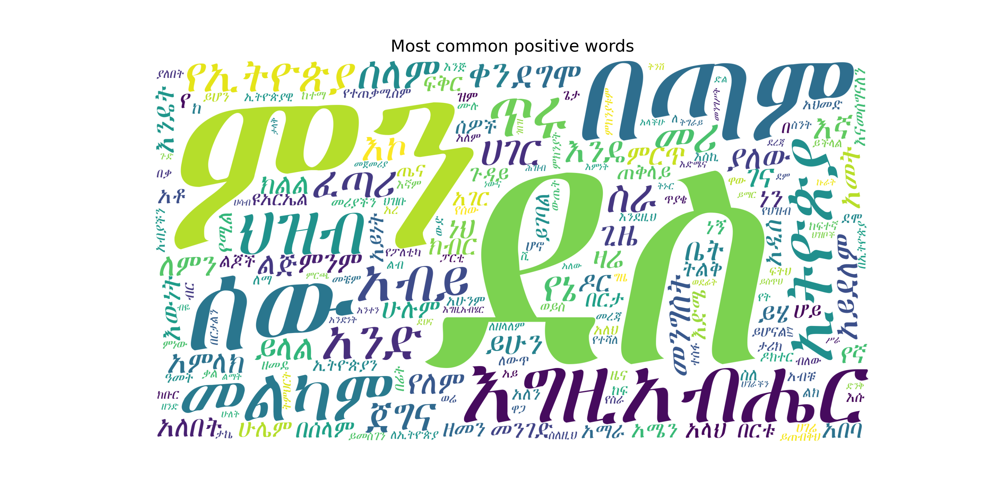
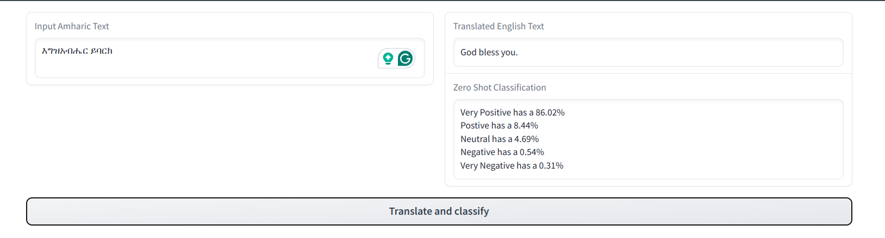

### Amharic Sentiment Analysis

This repository contains a Python-based tool for performing sentiment analysis on Amharic text. Amharic is the official language of Ethiopia and one of the Semitic languages spoken in the Horn of Africa region.

#### Features
- Sentiment classification: Classify Amharic text as either positive, negative, or neutral sentiment.
- Polarity scoring: Assign a numerical sentiment score ranging from -1 (negative) to +1 (positive) for Amharic text.
- fine-tuned model: The tool uses a pre-trained model and fine tunes it on specifically trained on Amharic data. which can be found in the data folder

#### Short cuts
If someone doesn't want the witty griddy details on how to fine tune a model and just wants a short implementation, the hugging_face folder conssists of a translation model and zero shot classification model which uses the NLLB (No langugage left Behind) model by facebook and DeBERTa-v3-base-mnli-fever-anli from MoritzLaurer respectively.
###### Steps
1. first use the nllb model to translate from amahric to english
2. then give a zero shot classification on that english text

Also there is an implemtation using gradio if you want to see it on a ui. 
